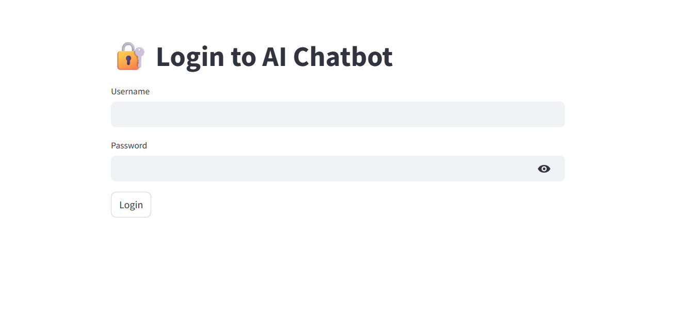
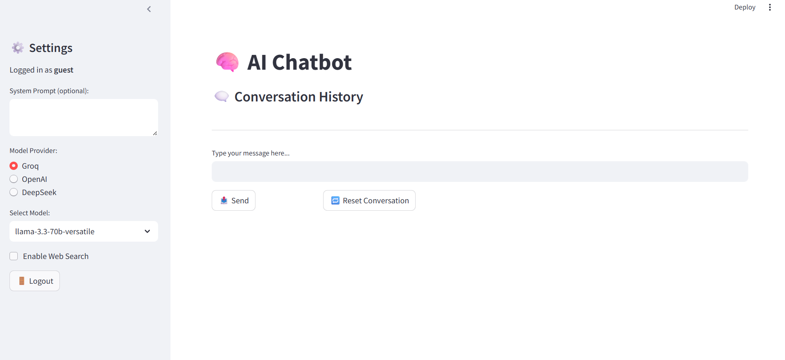

# 🤖 Multimodel Agentic Chatbot

🚀 An **agentic AI chatbot** that supports **multiple LLMs** (Groq, OpenAI, DeepSeek, etc.) with the ability to **enable web search** for real-time information.  
Built with **Streamlit** to provide a clean, interactive, and user-friendly interface.

---

## ✨ Features
- 🔐 **User Authentication** – Simple login screen before accessing the chatbot.  
- 🧠 **Multimodel Support** – Switch between Groq, OpenAI, DeepSeek (and more).  
- 🌐 **Web Search Integration** – Enable/disable web search for real-time responses.  
- ⚡ **Streamlit UI** – Modern, responsive, and interactive chatbot interface.  
- 📝 **System Prompt Control** – Customize the chatbot behavior with your own instructions.  
- 🗑️ **Conversation Reset** – Start fresh with one click.  

---

## 📸 Screenshots

### 🔑 Login Page  


### 💬 Chat Interface  


---

## 🛠️ Tech Stack
- [Streamlit](https://streamlit.io/) – UI framework  
- [FastAPI](https://fastapi.tiangolo.com/) – Backend API (optional if using)  
- [Redis/SQLite] – Session & storage (if enabled)  
- LLM Providers:  
  - [Groq](https://groq.com/)  
  - [OpenAI](https://openai.com/)  
  - [DeepSeek](https://deepseek.com/)  

---

## 🚀 Getting Started

### 1. Clone the Repository
```bash
git clone https://github.com/your-username/multimodel-agentic-chatbot.git
cd multimodel-agentic-chatbot
